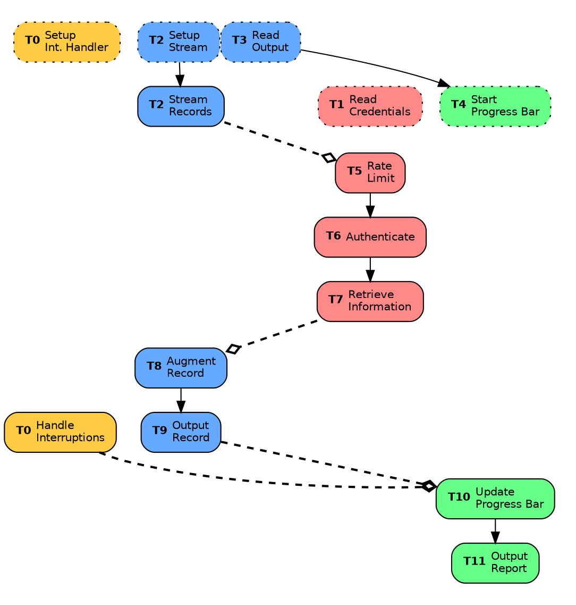

# Information Flow



* Step 1, 2, 3, and 4 are done synchronously, so are not executed concurrently / in parallel.
* The dashed lines indicate passing data to tasks in a different category. This may take the form of:

    - **`async` function call:**

        When a new instance of the task may be spawned each time.

        ```rust,edition2018,ignore
        pub struct Web(pub Credentials);
        impl Web {
            pub async fn retrieve_info(&self, _: &Record) -> PropertyInfo { .. }
        }

        // Invoked like so:
        web.retrieve_info(record).await;
        ```

    - **Channel Send/Receive:**

        When it is not possible to spawn multiple instances of the task, we use a long-lived task with a channel to receive data.

        ```rust,edition2018,ignore
        pub struct Reporter {
        #     pub progress_receiver: Receiver<ProgressUpdate>,
            pub report: Report,
        #     progress_overall: ProgressBar,
        }
        impl Reporter {
            pub async fn update(&mut self) {
                // When receiving a progress update from the channel.
        #         while let Some(process_result) = self.progress_receiver.recv().await {
        #             match process_result {
        #                 PropertyInfoResult::Success => {
                self.report.record_processed_successful_count += 1;
        #                 }
        #                 // ..
        #             }
        #             self.progress_overall.inc(1);
        #         }
            }
        }

        // Cannot do this per record because of `&mut self`:
        reporter.update(process_result).await;

        // Have to do this instead:
        progress_channel.send(process_result);
        ```
