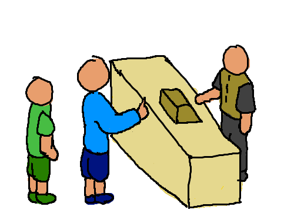

# Fast Food

Consider a fast food restaurant taking orders:

A simple, but low throughput method to handle orders is:

1. Accept order from customer 1.
2. Request order 1 to be made.
3. Wait for order 1 to be completed.
4. Give order 1 to customer 1.

Then,

5. Accept order from customer 2.
6. Request order 2 to be made.
7. Wait for order 2 to be completed.
8. Give order 2 to customer 2.

We can increase throughput of taking and completing orders through concurrency and parallelism.
