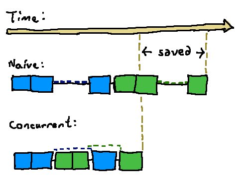

# Concurrency

* Workers can handle another customer's order while waiting for an earlier one to proceed.
* More efficient use of existing resources.

During the waiting time of the first order, we can start processing the second order:

