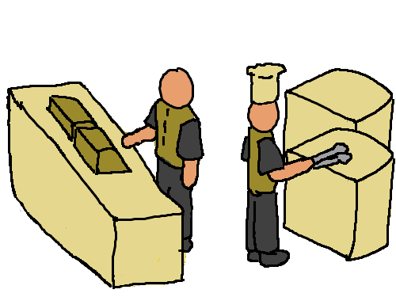

# Different Work

> One Request, Multiple Tasks

There are many steps needed to be done to complete one customer order.

For any worker that takes orders, their task is to:

1. Receive the order.
2. Request the kitchen to process the order.
3. Take the processed order and return it to the customer.

In the kitchen, the task is to:

1. Receive the order request.
2. Prepare the order.
3. Send it back to the counter.
