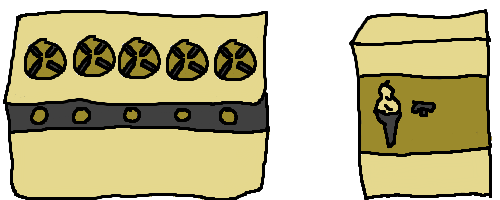

# Task Organization

When different kinds of tasks exist, we have organize them based on the resources they require.

* New Task Per Request (Resource may be shared):

    > "Turn on a new stove top each time an order needs to be processed."

    - One person can turn on multiple stove tops (can be concurrent).
    - Two people can turn on stove tops (can be parallel).
    - Only possible when the resource is able to handle it.

* One Long-Lived Task (Resource is exclusive):

    > "The ice cream machine can only create one ice cream at a time."

    - One person can only make one ice cream at one time (cannot be concurrent).
    - Cannot have two people make one ice cream each (cannot be parallel).
    - Only one person has access to the ice cream machine.
    - The person who has access receives requests to make ice creams, and sends them back.
